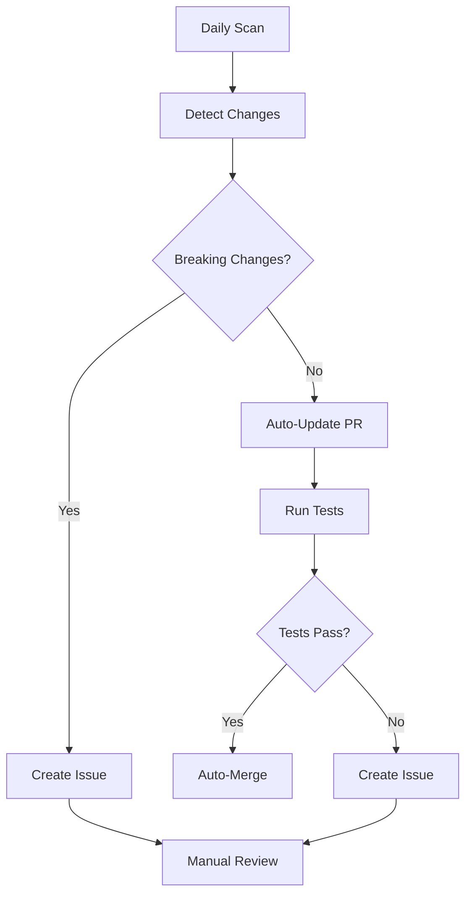

# Testable Tutorials Implementation Plan

## Overview

Implement a comprehensive system to ensure all tutorial content published on the AWS Research Wizard website is automatically tested and validated. This prevents outdated examples, broken commands, and ensures users have a reliable experience.

## Core Principles

1. **All tutorial code must be executable** - No dead examples
2. **Tests run in isolated environments** - No impact on production
3. **Automatic validation in CI/CD** - Catch issues before publication
4. **Real AWS integration testing** - Verify actual functionality
5. **Easy maintenance** - Automated updates when possible

## Implementation Strategy

### Phase 1: Tutorial Code Extraction System

**Goal**: Automatically extract and catalog all executable code from website content.

#### Components:

1. **Code Block Parser** (`tools/tutorial-extractor/`)
   ```go
   // Extract code blocks from HTML/Markdown with metadata
   type TutorialCode struct {
       ID          string            // Unique identifier
       Source      string            // File path or URL
       Language    string            // bash, yaml, etc.
       Code        string            // Actual code content
       Context     string            // Surrounding documentation
       Tags        []string          // Categories: setup, deploy, etc.
       Prerequisites []string        // What must run before this
   }
   ```

2. **Content Scanning**
   - Scan `go/docs/index.html` for `<pre>` and `<code>` blocks
   - Extract bash commands, YAML configs, CLI examples
   - Parse metadata from surrounding HTML context
   - Generate unique IDs for each code block

3. **Dependency Graph**
   - Build execution order based on prerequisites
   - Identify setup vs. demo vs. cleanup commands
   - Handle branching scenarios (different domains)

#### Output:
- `tutorials/extracted/` directory with individual `.sh`, `.yaml` files
- `tutorials/manifest.json` with execution metadata
- `tutorials/dependency-graph.json` for ordering

### Phase 2: Tutorial Testing Framework

**Goal**: Execute extracted tutorials in controlled environments with validation.

#### Test Environment Architecture:

```
tests/tutorials/
├── environments/           # Isolated test environments
│   ├── minimal/           # Basic AWS setup
│   ├── genomics/          # Genomics domain testing
│   └── climate/           # Climate modeling testing
├── runners/               # Test execution engines
│   ├── docker/           # Containerized testing
│   ├── vagrant/          # VM-based testing
│   └── aws-sandbox/      # AWS account testing
├── validators/           # Result validation
│   ├── command-success/  # Exit code validation
│   ├── resource-check/   # AWS resource verification
│   └── output-match/     # Expected output matching
└── fixtures/             # Test data and expectations
```

#### Test Runner Implementation:

```go
type TutorialTest struct {
    Environment string              // Which environment to use
    Code        TutorialCode        // Code to execute
    Validators  []Validator         // How to verify success
    Timeout     time.Duration       // Max execution time
    Cleanup     []string           // Cleanup commands
}

type TestResult struct {
    Success     bool
    Duration    time.Duration
    Output      string
    Errors      []string
    Resources   []AWSResource      // Created AWS resources
}
```

#### Validation Types:

1. **Command Success**: Verify exit codes
2. **Resource Creation**: Check AWS resources exist
3. **Output Matching**: Validate expected outputs
4. **Performance**: Ensure reasonable execution times
5. **Cleanup**: Verify resources are properly cleaned up

### Phase 3: AWS Sandbox Environment

**Goal**: Safe AWS testing environment that won't impact production.

#### Sandbox Configuration:

1. **Dedicated AWS Account**
   - Separate AWS account for tutorial testing
   - Strict IAM policies to prevent cost overruns
   - Automatic resource cleanup policies

2. **Resource Limits**
   ```yaml
   # sandbox-limits.yaml
   compute:
     max_instances: 5
     max_instance_types: ["t3.micro", "t3.small"]
     max_duration: "2h"

   storage:
     max_s3_buckets: 10
     max_ebs_volumes: 5
     max_storage_gb: 100

   networking:
     max_vpcs: 2
     max_subnets: 4
   ```

3. **Cost Controls**
   - AWS Budgets with alerts
   - CloudWatch billing alarms
   - Automatic resource termination after tests

4. **Test Data Management**
   - Pre-configured test datasets
   - Synthetic genomics/climate data for testing
   - Cached binary packages for faster tests

#### Safety Mechanisms:

- **Resource Tagging**: All test resources tagged for cleanup
- **Time Limits**: Maximum 2-hour test duration
- **Cost Limits**: Alert and stop at $50/day
- **Region Restriction**: Testing only in us-east-1
- **Cleanup Automation**: Nightly cleanup jobs

### Phase 4: CI/CD Integration

**Goal**: Automatic tutorial validation on every website update.

#### GitHub Actions Workflow:

```yaml
# .github/workflows/tutorial-validation.yml
name: Tutorial Validation

on:
  push:
    paths: ['go/docs/**', 'examples/**']
  schedule:
    - cron: '0 6 * * *'  # Daily validation

jobs:
  extract-tutorials:
    runs-on: ubuntu-latest
    steps:
      - name: Extract tutorial code
      - name: Generate test manifest
      - name: Upload artifacts

  test-tutorials:
    needs: extract-tutorials
    strategy:
      matrix:
        environment: [minimal, genomics, climate]
    runs-on: ubuntu-latest
    steps:
      - name: Setup AWS credentials
      - name: Run tutorial tests
      - name: Validate results
      - name: Cleanup resources

  update-status:
    needs: test-tutorials
    runs-on: ubuntu-latest
    steps:
      - name: Update tutorial status badges
      - name: Generate test report
      - name: Notify on failures
```

#### Test Execution Strategy:

1. **Quick Tests** (Every PR): Essential commands only
2. **Full Tests** (Daily): Complete tutorial flows
3. **Performance Tests** (Weekly): Load testing scenarios
4. **Integration Tests** (Release): End-to-end workflows

### Phase 5: Tutorial Maintenance Automation

**Goal**: Automatically keep tutorials current with minimal manual intervention.

#### Auto-Update Components:

1. **Version Detection**
   ```go
   // Monitor for new releases
   type VersionMonitor struct {
       Source      string  // GitHub, Docker Hub, etc.
       Pattern     string  // Version regex pattern
       Current     string  // Current version in tutorials
   }
   ```

2. **Dependency Updates**
   - Monitor AWS CLI versions
   - Track Spack package updates
   - Watch Docker image updates
   - Check domain pack versions

3. **Link Validation**
   - Verify all GitHub links
   - Check documentation URLs
   - Validate download links
   - Test example configurations

4. **Content Synchronization**
   - Compare tutorial commands with actual CLI help
   - Verify flag compatibility
   - Check parameter formats
   - Validate example outputs

#### Update Workflow:



### Phase 6: Quality Metrics & Monitoring

**Goal**: Continuous monitoring of tutorial health and user experience.

#### Metrics Dashboard:

1. **Tutorial Health**
   - Test success rates by tutorial
   - Average execution times
   - Resource usage patterns
   - Failure categorization

2. **User Experience**
   - Tutorial completion rates (analytics)
   - Common failure points
   - Support ticket correlation
   - Community feedback integration

3. **Maintenance Overhead**
   - Update frequency by component
   - Manual intervention rates
   - Test execution costs
   - Developer time investment

#### Alerting System:

- **Critical**: Tutorial completely broken (Slack alert)
- **Warning**: Performance degradation (Email)
- **Info**: New versions available (GitHub issue)

## Implementation Timeline

### Week 1-2: Foundation
- [ ] Implement code extraction system
- [ ] Create basic test framework
- [ ] Set up AWS sandbox account

### Week 3-4: Core Testing
- [ ] Build Docker-based test environments
- [ ] Implement tutorial runners
- [ ] Create validation framework

### Week 5-6: CI/CD Integration
- [ ] Set up GitHub Actions workflows
- [ ] Implement automated testing
- [ ] Create reporting system

### Week 7-8: Automation
- [ ] Build update monitoring
- [ ] Implement auto-update PRs
- [ ] Create maintenance dashboard

## File Structure

```
aws-research-wizard/
├── tools/tutorial-testing/
│   ├── extractor/              # Code extraction
│   ├── runner/                 # Test execution
│   ├── validator/              # Result validation
│   └── monitor/                # Update monitoring
├── tests/tutorials/
│   ├── environments/           # Test environments
│   ├── fixtures/               # Test data
│   └── results/                # Test outputs
├── .github/workflows/
│   └── tutorial-validation.yml # CI/CD pipeline
└── docs/
    └── tutorial-testing.md     # Documentation
```

## Success Criteria

1. **Zero broken tutorials** - All published examples work
2. **Fast feedback** - Test results within 15 minutes
3. **Low maintenance** - < 2 hours/week manual work
4. **Comprehensive coverage** - 90%+ of code examples tested
5. **Cost effective** - < $100/month AWS testing costs

## Benefits

1. **User Confidence**: Reliable, working examples
2. **Developer Efficiency**: Catch issues early
3. **Quality Assurance**: Systematic validation
4. **Documentation Quality**: Always current examples
5. **Community Trust**: Professional, maintained project

This system ensures AWS Research Wizard tutorials remain accurate, reliable, and user-friendly while minimizing maintenance overhead through automation.
