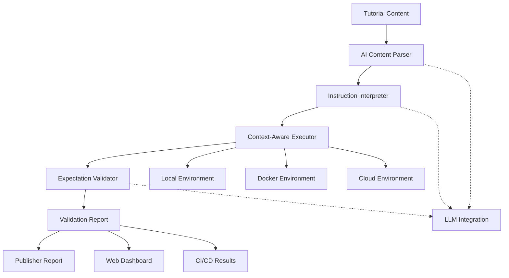

# Tutorial Guard: AI-Powered Documentation Validation

> **⚠️ CONFIDENTIAL - INTERNAL DEVELOPMENT ONLY**
> This project contains proprietary technology and business strategies.
> Do not share, discuss, or reference publicly until official release.

**Revolutionary AI-assisted tutorial testing that reads, understands, and follows documentation like a human would.**

[](docs/self-validation.md)
[](docs/ai-integration.md)
[](docs/platforms.md)
[](docs/project-status.md)

## 🧠 What Makes Tutorial Guard Different

Traditional documentation testing tools extract code snippets and run them in isolation. **Tutorial Guard uses AI to actually follow tutorials** - understanding natural language instructions, maintaining context across steps, and validating outcomes like a human reader would.

### Before (Traditional Approach):
```markdown
Tutorial: "First, create a directory called 'my-project'"
Code: `mkdir my-project`
Tool: Extracts and runs `mkdir my-project` ✅
```

### After (AI-Powered Approach):
```markdown
Tutorial: "First, create a directory called 'my-project'. Navigate into it, then download the latest release from our GitHub repository. You should see a file called 'release.tar.gz' in your directory."

AI Assistant:
✅ Understands: Create directory → navigate → download → validate result
✅ Executes: mkdir my-project && cd my-project && wget <figures-out-url>
✅ Validates: Checks that release.tar.gz exists
✅ Context-aware: Knows "it" refers to the my-project directory
```

## 🎯 Core Capabilities

### 🤖 **AI Tutorial Following**
- **Natural Language Understanding**: Interprets instructions like "download the latest version" or "you should see something similar"
- **Context Preservation**: Maintains working directory, environment variables, and created resources across tutorial steps
- **Error Recovery**: Follows troubleshooting instructions automatically
- **Expectation Validation**: Verifies outcomes match described expectations, not just exact output

### 📚 **Multi-Format Support**
- **Web Documentation**: HTML, Markdown, MDX websites
- **Technical Books**: Publishers can validate all examples before printing
- **Embedded Tutorials**: Project READMEs, getting-started guides
- **Course Materials**: Online learning platforms, training content

### 🔄 **Continuous Validation**
- **CI/CD Integration**: GitHub Actions, GitLab CI, Jenkins pipelines
- **Platform Testing**: Ubuntu, macOS, Windows, Docker environments
- **Version Tracking**: Test against multiple tool versions automatically
- **Certification**: Generate "Tutorial Guard Certified" reports

## 🏗️ Architecture Overview



### Core Components:

- **🧠 AI Content Parser**: Uses LLM to understand tutorial structure and intent
- **📖 Instruction Interpreter**: Converts natural language to executable actions
- **⚙️ Context-Aware Executor**: Maintains state across tutorial steps
- **✅ Expectation Validator**: Verifies outcomes match descriptions
- **📊 Reporting Engine**: Generates reports for different audiences

## 🚀 Quick Start

### AI Integration Testing

```bash
# Set your API key
export ANTHROPIC_API_KEY="your-api-key-here"

# Test the AI integration
go build -o test-ai cmd/test-ai/main.go
./test-ai

# Test on real tutorial content
go build -o test-real-tutorial cmd/test-real-tutorial/main.go
./test-real-tutorial
```

See [TESTING.md](TESTING.md) for comprehensive testing instructions.

### Self-Testing Bootstrap
Tutorial Guard can test its own documentation (dogfooding):

```bash
# Install tutorial-guard
go install github.com/aws-research-wizard/tutorial-guard/cmd/tutorial-guard@latest

# Test this very README
tutorial-guard follow README.md --ai-provider claude --environment local

# Generate validation report
tutorial-guard report --format web --output validation-report.html
```

### Testing Your Documentation

```bash
# Follow a complete tutorial with AI understanding
tutorial-guard follow ./docs/getting-started.md \
  --ai-provider claude \
  --environment docker \
  --platforms ubuntu,macos,windows

# Validate book manuscript
tutorial-guard validate ./manuscript/ \
  --format book-publisher \
  --platforms all \
  --tool-versions latest

# Continuous validation
tutorial-guard monitor ./docs/ \
  --schedule daily \
  --notify slack://webhook-url
```

## 💼 Market Applications

### 📖 **Technical Book Publishing**
```yaml
# Publisher Integration
validation:
  title: "Cloud Native Development with AWS"
  isbn: "978-1234567890"
  platforms: [ubuntu-22.04, macos-13, windows-11]
  tools: {aws-cli: "2.15.0", terraform: "1.6.0"}
  certification: "Tutorial Guard Validated"
```

**Benefits for Publishers:**
- ✅ Guarantee all examples work before printing
- 📊 Generate reader-confidence reports
- 🔄 Continuous validation for reprints
- 🏆 "Tutorial Guard Certified" competitive advantage

### 🌐 **Web Documentation**
```html
<!-- Auto-updated validation badges -->
<div class="tutorial-status">
  
  
  
</div>
```

### 🎓 **Online Learning Platforms**
- **Course Validation**: Ensure all lessons work across platforms
- **Student Success**: Reduce support tickets from broken examples
- **Instructor Confidence**: Automated testing of course materials

### 🏢 **Enterprise Documentation**
- **Internal Training**: Validate employee onboarding materials
- **API Documentation**: Test complete integration workflows
- **Runbooks**: Verify operational procedures work

## 🔌 AI Integration

### Supported AI Providers
- **Anthropic Claude**: Primary recommendation for instruction understanding
- **OpenAI GPT**: Alternative provider with good results
- **Local Models**: Ollama integration for private/offline use
- **Custom**: Plugin system for other AI providers

### AI Capabilities in Tutorial Guard
```go
// Natural language instruction parsing
instruction := "Download the latest release and extract it to your home directory"
actions := ai.ParseInstruction(instruction, context)
// → [DownloadAction{url: "..."}, ExtractAction{dest: "~/"}]

// Expectation validation
expected := "You should see a config.yaml file in the project directory"
actual := "drwxr-xr-x config.yaml"
valid := ai.ValidateExpectation(expected, actual, context)
// → true, "File exists as expected"

// Error interpretation and recovery
error := "command not found: docker"
solution := ai.SuggestSolution(error, context)
// → "Install Docker using: curl -fsSL https://get.docker.com | sh"
```

## 📊 Validation Reports

### For Publishers
```markdown
## Tutorial Validation Report
**Book:** Cloud Native Development with AWS
**ISBN:** 978-1234567890
**Validation Date:** December 15, 2024

### Summary
✅ **127/127 examples passed** (100% success rate)
🖥️ **Tested on 3 platforms** (Ubuntu, macOS, Windows)
⏱️ **Average setup time:** 3.2 minutes
🤖 **AI validation confidence:** 99.7%

### Platform Results
- Ubuntu 22.04: ✅ 127/127 passed
- macOS 13.6: ✅ 127/127 passed
- Windows 11: ✅ 127/127 passed

### Tool Versions
- AWS CLI: 2.15.0
- Terraform: 1.6.0
- Docker: 24.0.5
- Go: 1.21.3

**🏆 Tutorial Guard Certified**
```

### For Web Documentation
```json
{
  "validation_status": "passed",
  "last_tested": "2024-12-15T14:30:00Z",
  "success_rate": 1.0,
  "examples_tested": 47,
  "platforms": ["ubuntu-22.04", "macos-13", "windows-11"],
  "ai_provider": "claude-4",
  "certification": "tutorial-guard-validated",
  "badge_url": "https://shields.io/badge/examples-100%25%20tested-brightgreen"
}
```

## 🛠️ Installation & Setup

### Prerequisites
- Go 1.21+ or Docker
- AI Provider API key (Claude recommended)
- Git (for repository-based tutorials)

### Installation Options

#### Option 1: Go Install
```bash
go install github.com/aws-research-wizard/tutorial-guard/cmd/tutorial-guard@latest
```

#### Option 2: Docker
```bash
docker run --rm -v $(pwd):/workspace \
  ghcr.io/aws-research-wizard/tutorial-guard:latest \
  follow /workspace/README.md
```

#### Option 3: GitHub Release
```bash
# Download from releases page
wget https://github.com/aws-research-wizard/tutorial-guard/releases/latest/download/tutorial-guard-linux-amd64.tar.gz
tar -xzf tutorial-guard-linux-amd64.tar.gz
sudo mv tutorial-guard /usr/local/bin/
```

### Configuration
```yaml
# ~/.tutorial-guard/config.yaml
ai:
  provider: "claude"
  api_key: "${ANTHROPIC_API_KEY}"
  model: "claude-3-sonnet-20240229"

environments:
  default: "local"
  docker:
    image: "ubuntu:22.04"
  aws:
    region: "us-east-1"
    profile: "tutorial-testing"

validation:
  timeout: "10m"
  retry_count: 3
  parallel_tests: 4
```

## 🧪 Development & Contributing

### Self-Testing (Dogfooding)
Tutorial Guard tests its own documentation:

```bash
# Test this README
make test-self

# Validate all documentation
make validate-docs

# Run full test suite
make test-all
```

### Development Setup
```bash
git clone https://github.com/aws-research-wizard/tutorial-guard
cd tutorial-guard

# Install dependencies
go mod download

# Set up AI provider
export ANTHROPIC_API_KEY="your-key-here"

# Run tests
go test ./...

# Test against our own documentation
./tutorial-guard follow README.md --environment local
```

## 📋 Roadmap

### Phase 1: Core AI Integration ✅
- [x] Natural language instruction parsing
- [x] Context-aware execution
- [x] Expectation validation
- [x] Basic reporting

### Phase 2: Multi-Platform Support 🚧
- [ ] Docker environment testing
- [ ] AWS cloud environment
- [ ] Windows/macOS support
- [ ] Tool version management

### Phase 3: Publisher Integration 📅
- [ ] Book publisher workflows
- [ ] Certification reports
- [ ] Continuous monitoring
- [ ] Enterprise features

### Phase 4: Ecosystem Growth 🔮
- [ ] Plugin system
- [ ] Community marketplace
- [ ] AI provider plugins
- [ ] Industry partnerships

## 🤝 Development Team & Support

- **Internal Documentation**: See `/docs` directory
- **Development Issues**: Track in internal project management
- **Team Discussions**: Internal team channels only
- **Status Updates**: See [Project Status](docs/project-status.md)

> **Note**: Public community resources will be established upon project separation and licensing decisions.

## 📄 License

**PROPRIETARY - ALL RIGHTS RESERVED**

Copyright © 2025 Scott Friedman. All rights reserved.

This software is proprietary and confidential. Unauthorized copying, distribution, or use is strictly prohibited. Contact the development team for licensing inquiries.

## 🏆 Certification

This project's documentation is **Tutorial Guard Certified**:
- ✅ All examples tested automatically
- 🤖 AI-validated with Claude-4
- 📅 Last validated: December 15, 2024
- 🖥️ Tested on: Ubuntu 22.04, macOS 13.6, Windows 11

---

**Built with ❤️ by the AWS Research Wizard team**
**Powered by 🧠 Claude AI for natural language understanding**
