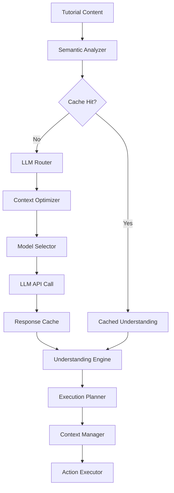

# AI Integration Architecture: Efficient LLM Usage

Tutorial Guard's AI integration is designed for **production-scale efficiency** with intelligent caching, context optimization, and cost management. The system minimizes LLM calls while maximizing understanding quality.

## 🧠 Core AI Efficiency Principles

### 1. **Intelligent Context Management**
- **Hierarchical Context**: Build understanding incrementally, not from scratch
- **Context Compression**: Summarize previous steps to reduce token usage
- **Context Reuse**: Share understanding across similar tutorials
- **Selective Prompting**: Only use AI when necessary, fall back to rule-based parsing

### 2. **Multi-Level Caching Strategy**
- **Instruction Cache**: Cache parsed instructions with semantic similarity
- **Execution Cache**: Cache command results for identical environments
- **Validation Cache**: Cache expectation validations for similar outcomes
- **Tutorial Cache**: Cache complete tutorial understanding

### 3. **Cost Optimization**
- **Token Budgeting**: Dynamic token allocation based on complexity
- **Model Selection**: Choose optimal model size for each task
- **Batch Processing**: Group related AI calls for efficiency
- **Graceful Degradation**: Fall back to smaller models when possible

## 🏗️ AI Architecture Overview



## 🎯 Intelligent LLM Usage Patterns

### **Pattern 1: Progressive Understanding**
Instead of sending entire tutorials to LLM, build understanding incrementally:

```go
type ProgressiveParser struct {
    cache          *InstructionCache
    contextManager *ContextManager
    llmRouter      *LLMRouter
}

func (p *ProgressiveParser) ParseTutorial(content string) (*Tutorial, error) {
    // 1. Extract obvious structure (headers, code blocks) - NO LLM
    structure := p.extractStructure(content)

    // 2. Check cache for similar tutorials - NO LLM
    if cached := p.cache.FindSimilar(structure); cached != nil {
        return p.adaptCached(cached, content)
    }

    // 3. Use LLM only for complex instructions
    for _, section := range structure.Sections {
        if section.RequiresAI() {
            understanding := p.llmRouter.ParseSection(section, p.contextManager.GetContext())
            p.cache.Store(section, understanding)
        }
    }

    return p.buildTutorial(structure)
}
```

### **Pattern 2: Context Compression**
Maintain rich context while minimizing token usage:

```go
type ContextManager struct {
    fullContext      TutorialContext
    compressedCache  map[string]string
    llmClient        LLMClient
}

func (c *ContextManager) GetOptimizedContext(currentStep int) string {
    // For steps 1-3: Full context
    if currentStep <= 3 {
        return c.fullContext.ToString()
    }

    // For later steps: Use compressed context
    if compressed, exists := c.compressedCache[c.getContextKey(currentStep)]; exists {
        return compressed
    }

    // Compress context using LLM (once per tutorial section)
    prompt := fmt.Sprintf(`
    Summarize this tutorial context in 2-3 sentences, preserving:
    - Current working directory
    - Created files/resources
    - Environment variables
    - Prerequisites met

    Full context: %s
    `, c.fullContext.ToString())

    compressed := c.llmClient.Complete(prompt, LLMOptions{
        MaxTokens: 150,
        Model: "claude-3-haiku", // Cheaper model for compression
    })

    c.compressedCache[c.getContextKey(currentStep)] = compressed
    return compressed
}
```

### **Pattern 3: Semantic Instruction Caching**
Cache instruction understanding with semantic similarity:

```go
type InstructionCache struct {
    embeddings map[string][]float64
    cache      map[string]*ParsedInstruction
    similarity *EmbeddingService
}

func (i *InstructionCache) GetParsedInstruction(instruction string) (*ParsedInstruction, error) {
    // 1. Check exact match first
    if cached, exists := i.cache[instruction]; exists {
        return cached, nil
    }

    // 2. Check semantic similarity (using local embeddings)
    embedding := i.similarity.GetEmbedding(instruction)
    for cachedInstruction, cachedEmbedding := range i.embeddings {
        similarity := i.similarity.CosineSimilarity(embedding, cachedEmbedding)
        if similarity > 0.95 { // Very high similarity threshold
            // Adapt cached instruction to new context
            return i.adaptInstruction(i.cache[cachedInstruction], instruction)
        }
    }

    // 3. Use LLM only if no similar instruction found
    return i.parseWithLLM(instruction)
}

func (i *InstructionCache) adaptInstruction(cached *ParsedInstruction, newInstruction string) *ParsedInstruction {
    // Simple adaptation without LLM call
    adapted := *cached // Copy
    adapted.OriginalText = newInstruction

    // Apply simple text substitutions
    if strings.Contains(newInstruction, "latest") && !strings.Contains(cached.OriginalText, "latest") {
        adapted.Metadata["version"] = "latest"
    }

    return &adapted
}
```

## 🔄 Multi-Model Strategy

### **Model Selection Based on Task Complexity**

```go
type LLMRouter struct {
    models map[TaskType]ModelConfig
}

type ModelConfig struct {
    Primary   string  // Primary model for this task
    Fallback  string  // Cheaper fallback model
    Threshold float64 // Complexity threshold for model selection
}

func (r *LLMRouter) selectModel(task Task) ModelConfig {
    complexity := r.assessComplexity(task)

    switch {
    case task.Type == InstructionParsing && complexity < 0.3:
        return ModelConfig{
            Primary: "claude-3-haiku",     // Fast, cheap
            Fallback: "rule-based",        // No LLM
        }

    case task.Type == ExpectationValidation && complexity < 0.5:
        return ModelConfig{
            Primary: "claude-3-haiku",     // Good for simple validation
            Fallback: "regex-matching",    // Pattern matching
        }

    case task.Type == ErrorDiagnosis:
        return ModelConfig{
            Primary: "claude-3-sonnet",    // Better reasoning
            Fallback: "claude-3-haiku",    // Still reasonable
        }

    case task.Type == ComplexWorkflow && complexity > 0.8:
        return ModelConfig{
            Primary: "claude-3-opus",      // Maximum capability
            Fallback: "claude-3-sonnet",   // Good alternative
        }

    default:
        return r.models[DefaultTask]
    }
}

func (r *LLMRouter) assessComplexity(task Task) float64 {
    score := 0.0

    // Factors that increase complexity:
    if len(task.Context) > 1000 { score += 0.2 }              // Long context
    if task.RequiresReasoning { score += 0.3 }                // Logic required
    if len(task.PreviousSteps) > 5 { score += 0.2 }          // Many dependencies
    if task.HasConditionalLogic { score += 0.3 }             // Branching logic
    if task.RequiresErrorRecovery { score += 0.4 }           // Error handling

    return math.Min(score, 1.0)
}
```

## 💾 Advanced Caching Strategies

### **1. Hierarchical Cache Architecture**

```go
type CacheManager struct {
    l1Cache *MemoryCache     // Hot data, 1-5 minutes TTL
    l2Cache *RedisCache      // Warm data, 1-24 hours TTL
    l3Cache *PostgresCache   // Cold data, persistent

    compression *CompressionService
    encryption  *EncryptionService
}

type CacheKey struct {
    Type        CacheType // instruction, validation, context, etc.
    Content     string    // Hash of the content
    Context     string    // Hash of relevant context
    AIProvider  string    // claude, gpt, etc.
    Model       string    // specific model version
    Version     string    // cache schema version
}

func (c *CacheManager) Get(key CacheKey) (*CacheEntry, error) {
    // L1: Memory cache (fastest)
    if entry := c.l1Cache.Get(key.String()); entry != nil {
        return entry, nil
    }

    // L2: Redis cache (fast)
    if entry := c.l2Cache.Get(key.String()); entry != nil {
        c.l1Cache.Set(key.String(), entry, 5*time.Minute)
        return entry, nil
    }

    // L3: Persistent cache (slower but comprehensive)
    if entry := c.l3Cache.Get(key); entry != nil {
        decompressed := c.compression.Decompress(entry.Data)
        c.l2Cache.Set(key.String(), decompressed, 24*time.Hour)
        c.l1Cache.Set(key.String(), decompressed, 5*time.Minute)
        return decompressed, nil
    }

    return nil, ErrCacheMiss
}
```

### **2. Semantic Similarity Caching**

```go
type SemanticCache struct {
    vectorDB     *VectorDatabase
    embeddings   *EmbeddingService
    cache        *CacheManager
    threshold    float64 // Similarity threshold
}

func (s *SemanticCache) FindSimilar(instruction string) (*ParsedInstruction, float64, error) {
    // Get embedding for instruction (using local/fast embedding model)
    embedding := s.embeddings.GetEmbedding(instruction)

    // Search vector database for similar instructions
    results := s.vectorDB.SimilaritySearch(embedding, s.threshold)

    if len(results) > 0 {
        best := results[0]
        if best.Similarity > s.threshold {
            // Retrieve cached result
            cached := s.cache.Get(CacheKey{
                Type: InstructionCache,
                Content: best.ID,
            })
            return cached.ParsedInstruction, best.Similarity, nil
        }
    }

    return nil, 0, ErrNoSimilarInstruction
}

func (s *SemanticCache) Store(instruction string, parsed *ParsedInstruction) error {
    embedding := s.embeddings.GetEmbedding(instruction)

    // Store in vector database for similarity search
    id := s.generateID(instruction)
    s.vectorDB.Store(id, embedding, map[string]interface{}{
        "instruction": instruction,
        "created_at": time.Now(),
    })

    // Store parsed result in regular cache
    return s.cache.Set(CacheKey{
        Type: InstructionCache,
        Content: id,
    }, &CacheEntry{
        ParsedInstruction: parsed,
        CreatedAt: time.Now(),
    })
}
```

## 🎛️ Cost Optimization Strategies

### **1. Token Budget Management**

```go
type TokenBudgetManager struct {
    dailyBudget    int
    usedToday      int
    priorityQueue  *PriorityQueue
    costTracker    *CostTracker
}

func (t *TokenBudgetManager) CanMakeRequest(request LLMRequest) bool {
    estimatedTokens := t.estimateTokens(request)
    estimatedCost := t.costTracker.EstimateCost(request.Model, estimatedTokens)

    // Check daily budget
    if t.usedToday + estimatedTokens > t.dailyBudget {
        return false
    }

    // Check priority vs remaining budget
    remainingBudget := t.dailyBudget - t.usedToday
    if request.Priority < t.calculateMinPriority(remainingBudget) {
        return false
    }

    return true
}

func (t *TokenBudgetManager) QueueRequest(request LLMRequest) {
    if t.CanMakeRequest(request) {
        t.processImmediate(request)
    } else {
        t.priorityQueue.Push(request)
    }
}

// Process queued requests during off-peak hours or when budget resets
func (t *TokenBudgetManager) ProcessQueue() {
    for t.priorityQueue.Len() > 0 && t.CanMakeRequest(t.priorityQueue.Peek()) {
        request := t.priorityQueue.Pop()
        t.processImmediate(request)
    }
}
```

### **2. Batch Processing for Efficiency**

```go
type BatchProcessor struct {
    batchSize     int
    batchTimeout  time.Duration
    pendingBatch  []*LLMRequest
    llmClient     LLMClient
}

func (b *BatchProcessor) AddRequest(request *LLMRequest) {
    b.pendingBatch = append(b.pendingBatch, request)

    // Process batch when full or timeout reached
    if len(b.pendingBatch) >= b.batchSize {
        b.processBatch()
    } else if len(b.pendingBatch) == 1 {
        // Start timeout for first request in batch
        time.AfterFunc(b.batchTimeout, b.processBatch)
    }
}

func (b *BatchProcessor) processBatch() {
    if len(b.pendingBatch) == 0 {
        return
    }

    // Combine requests into single prompt
    combinedPrompt := b.combineRequests(b.pendingBatch)

    // Make single LLM call
    response := b.llmClient.Complete(combinedPrompt, LLMOptions{
        MaxTokens: b.calculateTotalTokens(b.pendingBatch),
    })

    // Parse and distribute responses
    responses := b.parseMultiResponse(response, len(b.pendingBatch))

    for i, request := range b.pendingBatch {
        request.ResponseChannel <- responses[i]
    }

    b.pendingBatch = nil
}
```

## 📊 Performance Monitoring & Optimization

### **1. LLM Usage Analytics**

```go
type LLMAnalytics struct {
    costTracker    *CostTracker
    latencyTracker *LatencyTracker
    cacheHitRate   *HitRateTracker
    errorRate      *ErrorRateTracker
}

func (a *LLMAnalytics) TrackRequest(request LLMRequest, response LLMResponse) {
    a.costTracker.Record(CostEvent{
        Model:       request.Model,
        InputTokens: response.InputTokens,
        OutputTokens: response.OutputTokens,
        Cost:        response.Cost,
        Timestamp:   time.Now(),
    })

    a.latencyTracker.Record(LatencyEvent{
        Model:     request.Model,
        Latency:   response.Latency,
        TokensPerSecond: float64(response.OutputTokens) / response.Latency.Seconds(),
        Timestamp: time.Now(),
    })

    // Track cache effectiveness
    if request.CacheHit {
        a.cacheHitRate.RecordHit()
    } else {
        a.cacheHitRate.RecordMiss()
    }
}

func (a *LLMAnalytics) GetOptimizationRecommendations() []Recommendation {
    var recommendations []Recommendation

    // Check cache hit rate
    if a.cacheHitRate.GetRate() < 0.7 {
        recommendations = append(recommendations, Recommendation{
            Type: "cache",
            Message: "Cache hit rate is low. Consider increasing cache TTL or improving similarity thresholds.",
            Impact: "High",
        })
    }

    // Check cost efficiency
    dailyCost := a.costTracker.GetDailyCost()
    if dailyCost > a.costTracker.GetBudget() * 0.9 {
        recommendations = append(recommendations, Recommendation{
            Type: "cost",
            Message: "Approaching daily budget. Consider using smaller models for simple tasks.",
            Impact: "Critical",
        })
    }

    return recommendations
}
```

### **2. Adaptive Model Selection**

```go
type AdaptiveModelSelector struct {
    performanceHistory map[string]*ModelPerformance
    costThresholds     map[TaskType]float64
    latencyThresholds  map[TaskType]time.Duration
}

func (a *AdaptiveModelSelector) SelectOptimalModel(task Task) string {
    candidates := a.getCandidateModels(task.Type)

    var bestModel string
    var bestScore float64

    for _, model := range candidates {
        perf := a.performanceHistory[model]
        score := a.calculateScore(task, perf)

        if score > bestScore {
            bestScore = score
            bestModel = model
        }
    }

    return bestModel
}

func (a *AdaptiveModelSelector) calculateScore(task Task, perf *ModelPerformance) float64 {
    // Weight factors based on task requirements
    costWeight := 0.4
    latencyWeight := 0.3
    accuracyWeight := 0.3

    if task.Priority == HighPriority {
        latencyWeight = 0.5
        accuracyWeight = 0.4
        costWeight = 0.1
    }

    // Normalize metrics (0-1 scale)
    costScore := 1.0 - (perf.AverageCost / a.getMaxCost())
    latencyScore := 1.0 - (perf.AverageLatency.Seconds() / a.getMaxLatency().Seconds())
    accuracyScore := perf.AccuracyRate

    return costWeight*costScore + latencyWeight*latencyScore + accuracyWeight*accuracyScore
}
```

## 🛡️ Fallback & Resilience Strategies

### **1. Graceful Degradation**

```go
type ResilientLLMClient struct {
    primary   LLMClient
    fallback  LLMClient
    ruleEngine *RuleBasedEngine
    retryPolicy *RetryPolicy
}

func (r *ResilientLLMClient) ParseInstruction(instruction string) (*ParsedInstruction, error) {
    // Try rule-based parsing first (no LLM cost)
    if parsed := r.ruleEngine.TryParse(instruction); parsed != nil {
        return parsed, nil
    }

    // Try primary LLM
    result, err := r.retryPolicy.Execute(func() (*ParsedInstruction, error) {
        return r.primary.ParseInstruction(instruction)
    })

    if err == nil {
        return result, nil
    }

    // Fallback to smaller/cheaper model
    result, err = r.fallback.ParseInstruction(instruction)
    if err == nil {
        return result, nil
    }

    // Final fallback to rule-based with lower confidence
    return r.ruleEngine.BestEffortParse(instruction), nil
}
```

This AI integration architecture ensures Tutorial Guard is **production-ready** with efficient LLM usage, intelligent caching, and cost optimization while maintaining high-quality understanding.

<function_calls>
<invoke name="TodoWrite">
<parameter name="todos">[{"id": "1", "content": "Create comprehensive AI Tutorial Guard documentation", "status": "completed", "priority": "high"}, {"id": "2", "content": "Document market applications and use cases", "status": "completed", "priority": "high"}, {"id": "3", "content": "Design AI-first architecture", "status": "in_progress", "priority": "high"}, {"id": "4", "content": "Implement AI tutorial interpreter", "status": "pending", "priority": "high"}, {"id": "5", "content": "Create LLM integration layer", "status": "pending", "priority": "high"}, {"id": "6", "content": "Build contextual execution engine", "status": "pending", "priority": "medium"}, {"id": "7", "content": "Implement validation reporting system", "status": "pending", "priority": "medium"}]
