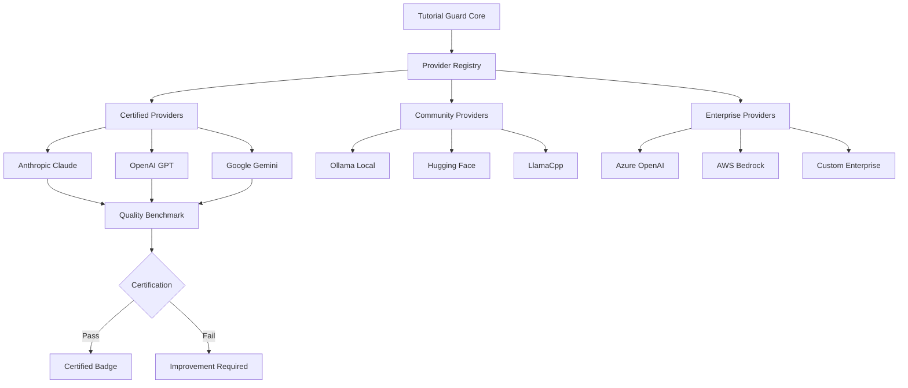

# Pluggable AI Backend Architecture

Tutorial Guard uses a **curated plugin system** for AI backends - providing flexibility across providers while maintaining quality through certification and validation processes.

## 🎯 Core Design Principles

### **Flexibility with Quality Assurance**
- **Multiple Provider Support**: Claude, GPT, Local models, Custom solutions
- **Certified Providers**: All backends must pass rigorous quality benchmarks
- **Standardized Interface**: Consistent behavior across different AI providers
- **Performance Guarantees**: Minimum accuracy and latency requirements
- **Graceful Degradation**: Automatic fallback between providers

### **Enterprise & Privacy Considerations**
- **On-Premise Options**: Local model support for security-sensitive environments
- **Air-Gapped Deployments**: Fully offline AI capabilities
- **Compliance Ready**: SOC2, GDPR, HIPAA compatible backends
- **Cost Control**: Flexible pricing models for different use cases

## 🏗️ Backend Provider Architecture



## 🔌 Provider Interface Standard

### **Core Provider Interface**
```go
// AIProvider defines the standard interface all backends must implement
type AIProvider interface {
    // Core capabilities
    ParseInstruction(ctx context.Context, instruction string, context TutorialContext) (*ParsedInstruction, error)
    ValidateExpectation(ctx context.Context, expected, actual string, context TutorialContext) (*ValidationResult, error)
    CompressContext(ctx context.Context, fullContext TutorialContext) (*CompressedContext, error)

    // Provider metadata
    GetCapabilities() ProviderCapabilities
    GetCostEstimate(request AIRequest) CostEstimate
    GetPerformanceMetrics() PerformanceMetrics

    // Health and monitoring
    HealthCheck(ctx context.Context) error
    GetUsageStats() UsageStats

    // Configuration
    Configure(config ProviderConfig) error
    ValidateConfig() error
}

type ProviderCapabilities struct {
    Name                string            `json:"name"`
    Version             string            `json:"version"`
    MaxContextLength    int               `json:"max_context_length"`
    SupportedLanguages  []string          `json:"supported_languages"`
    Features           []string          `json:"features"`
    CostModel          CostModel         `json:"cost_model"`
    LatencyProfile     LatencyProfile    `json:"latency_profile"`
    QualityScore       float64           `json:"quality_score"`       // 0-1, from certification
    CertificationLevel CertificationLevel `json:"certification_level"`
}

type CertificationLevel string
const (
    CertifiedGold   CertificationLevel = "gold"      // Highest quality, recommended
    CertifiedSilver CertificationLevel = "silver"    // Good quality, approved
    CertifiedBronze CertificationLevel = "bronze"    // Basic quality, experimental
    Community       CertificationLevel = "community" // Not officially certified
    Enterprise      CertificationLevel = "enterprise" // Custom enterprise validation
)
```

### **Provider Registration & Discovery**
```go
type ProviderRegistry struct {
    providers       map[string]AIProvider
    certifications  map[string]*CertificationResult
    benchmarkSuite  *QualityBenchmark
    updateChecker   *ProviderUpdateChecker
}

func (r *ProviderRegistry) RegisterProvider(provider AIProvider) error {
    // Validate provider implements interface correctly
    if err := r.validateInterface(provider); err != nil {
        return fmt.Errorf("interface validation failed: %w", err)
    }

    // Run quality benchmarks (required for certification)
    result := r.benchmarkSuite.RunBenchmarks(provider)
    if result.OverallScore < 0.7 {
        return fmt.Errorf("provider quality score %f below minimum threshold 0.7", result.OverallScore)
    }

    // Store certification results
    r.certifications[provider.GetCapabilities().Name] = result
    r.providers[provider.GetCapabilities().Name] = provider

    return nil
}

func (r *ProviderRegistry) GetRecommendedProvider(task TaskType, constraints ProviderConstraints) AIProvider {
    candidates := r.filterProviders(task, constraints)

    // Score providers based on task requirements
    bestProvider := r.scoreProviders(candidates, task)

    return bestProvider
}

type ProviderConstraints struct {
    MaxLatency        time.Duration     `json:"max_latency"`
    MaxCostPerRequest float64          `json:"max_cost_per_request"`
    RequireOffline    bool             `json:"require_offline"`
    RequireEnterprise bool             `json:"require_enterprise"`
    MinQualityScore   float64          `json:"min_quality_score"`
    PreferredRegion   string           `json:"preferred_region"`
}
```

## 🏅 Quality Certification System

### **Benchmark Test Suite**
```go
type QualityBenchmark struct {
    instructionParsing   *InstructionParsingBenchmark
    expectationValidation *ExpectationValidationBenchmark
    contextManagement    *ContextManagementBenchmark
    errorRecovery        *ErrorRecoveryBenchmark
    performanceTest      *PerformanceBenchmark
}

type BenchmarkResult struct {
    ProviderName        string            `json:"provider_name"`
    TestDate           time.Time         `json:"test_date"`
    OverallScore       float64           `json:"overall_score"`
    CategoryScores     map[string]float64 `json:"category_scores"`
    PerformanceMetrics PerformanceMetrics `json:"performance_metrics"`
    CertificationLevel CertificationLevel `json:"certification_level"`

    // Detailed results
    InstructionAccuracy    float64 `json:"instruction_accuracy"`
    ExpectationAccuracy    float64 `json:"expectation_accuracy"`
    ContextHandling        float64 `json:"context_handling"`
    ErrorRecovery          float64 `json:"error_recovery"`
    Latency               time.Duration `json:"latency"`
    CostEfficiency        float64 `json:"cost_efficiency"`
}

func (q *QualityBenchmark) RunBenchmarks(provider AIProvider) *BenchmarkResult {
    result := &BenchmarkResult{
        ProviderName: provider.GetCapabilities().Name,
        TestDate:    time.Now(),
        CategoryScores: make(map[string]float64),
    }

    // Test 1: Instruction Parsing Accuracy
    result.InstructionAccuracy = q.instructionParsing.Test(provider)
    result.CategoryScores["instruction_parsing"] = result.InstructionAccuracy

    // Test 2: Expectation Validation Accuracy
    result.ExpectationAccuracy = q.expectationValidation.Test(provider)
    result.CategoryScores["expectation_validation"] = result.ExpectationAccuracy

    // Test 3: Context Management
    result.ContextHandling = q.contextManagement.Test(provider)
    result.CategoryScores["context_handling"] = result.ContextHandling

    // Test 4: Error Recovery
    result.ErrorRecovery = q.errorRecovery.Test(provider)
    result.CategoryScores["error_recovery"] = result.ErrorRecovery

    // Test 5: Performance & Cost
    perfMetrics := q.performanceTest.Test(provider)
    result.PerformanceMetrics = perfMetrics
    result.Latency = perfMetrics.AverageLatency
    result.CostEfficiency = perfMetrics.CostEfficiencyScore

    // Calculate overall score
    result.OverallScore = q.calculateOverallScore(result)
    result.CertificationLevel = q.determineCertificationLevel(result.OverallScore)

    return result
}

func (q *QualityBenchmark) calculateOverallScore(result *BenchmarkResult) float64 {
    weights := map[string]float64{
        "instruction_parsing":     0.25,
        "expectation_validation": 0.25,
        "context_handling":       0.20,
        "error_recovery":         0.15,
        "cost_efficiency":        0.15,
    }

    score := 0.0
    for category, weight := range weights {
        if categoryScore, exists := result.CategoryScores[category]; exists {
            score += categoryScore * weight
        }
    }

    // Apply performance penalty for high latency
    if result.Latency > 10*time.Second {
        score *= 0.8 // 20% penalty for slow responses
    }

    return score
}
```

### **Certification Levels & Requirements**

```yaml
certification_levels:
  gold:
    requirements:
      overall_score: ">= 0.9"
      instruction_accuracy: ">= 0.95"
      expectation_accuracy: ">= 0.90"
      context_handling: ">= 0.85"
      max_latency: "5s"
      cost_efficiency: ">= 0.7"
    benefits:
      - "Recommended for production use"
      - "Featured in provider selection"
      - "Priority support for integration issues"
      - "Marketing co-promotion opportunities"

  silver:
    requirements:
      overall_score: ">= 0.8"
      instruction_accuracy: ">= 0.85"
      expectation_accuracy: ">= 0.80"
      context_handling: ">= 0.75"
      max_latency: "10s"
      cost_efficiency: ">= 0.6"
    benefits:
      - "Approved for production use"
      - "Listed in provider documentation"
      - "Standard integration support"

  bronze:
    requirements:
      overall_score: ">= 0.7"
      instruction_accuracy: ">= 0.75"
      expectation_accuracy: ">= 0.70"
      context_handling: ">= 0.65"
      max_latency: "15s"
      cost_efficiency: ">= 0.5"
    benefits:
      - "Experimental use approved"
      - "Community documentation"
      - "Best-effort support"
```

## 🔐 Provider Categories

### **1. Certified Cloud Providers (Gold Standard)**

#### **Anthropic Claude**
```go
type ClaudeProvider struct {
    client    *anthropic.Client
    model     string
    cache     *ResponseCache
    metrics   *ProviderMetrics
}

func (c *ClaudeProvider) GetCapabilities() ProviderCapabilities {
    return ProviderCapabilities{
        Name:               "anthropic-claude",
        Version:            "3.5-sonnet",
        MaxContextLength:   200000,
        SupportedLanguages: []string{"en", "es", "fr", "de", "ja", "zh"},
        Features:          []string{"instruction_parsing", "expectation_validation", "context_compression", "error_analysis"},
        CostModel:         CostModel{InputTokenPrice: 0.000003, OutputTokenPrice: 0.000015},
        LatencyProfile:    LatencyProfile{P50: "2s", P95: "8s", P99: "15s"},
        QualityScore:      0.94,
        CertificationLevel: CertifiedGold,
    }
}
```

#### **OpenAI GPT**
```go
type OpenAIProvider struct {
    client    *openai.Client
    model     string
    cache     *ResponseCache
    metrics   *ProviderMetrics
}

func (o *OpenAIProvider) GetCapabilities() ProviderCapabilities {
    return ProviderCapabilities{
        Name:               "openai-gpt",
        Version:            "gpt-4-turbo",
        MaxContextLength:   128000,
        SupportedLanguages: []string{"en", "es", "fr", "de", "ja", "zh", "ru", "pt"},
        Features:          []string{"instruction_parsing", "expectation_validation", "context_compression", "code_analysis"},
        CostModel:         CostModel{InputTokenPrice: 0.00001, OutputTokenPrice: 0.00003},
        LatencyProfile:    LatencyProfile{P50: "3s", P95: "12s", P99: "20s"},
        QualityScore:      0.91,
        CertificationLevel: CertifiedGold,
    }
}
```

### **2. Local/Offline Providers (Privacy-First)**

#### **Ollama Integration**
```go
type OllamaProvider struct {
    endpoint  string
    model     string
    client    *ollama.Client
    cache     *LocalCache
}

func (o *OllamaProvider) GetCapabilities() ProviderCapabilities {
    return ProviderCapabilities{
        Name:               "ollama-local",
        Version:            "llama3.1:8b",
        MaxContextLength:   8192,
        SupportedLanguages: []string{"en"},
        Features:          []string{"instruction_parsing", "basic_validation", "offline"},
        CostModel:         CostModel{InputTokenPrice: 0, OutputTokenPrice: 0}, // Free but requires compute
        LatencyProfile:    LatencyProfile{P50: "5s", P95: "15s", P99: "30s"},
        QualityScore:      0.78,
        CertificationLevel: CertifiedSilver,
    }
}

func (o *OllamaProvider) HealthCheck(ctx context.Context) error {
    // Check if Ollama service is running locally
    resp, err := o.client.Ping(ctx)
    if err != nil {
        return fmt.Errorf("ollama service unavailable: %w", err)
    }

    // Verify model is downloaded
    models, err := o.client.ListModels(ctx)
    if err != nil {
        return fmt.Errorf("failed to list models: %w", err)
    }

    for _, model := range models {
        if model.Name == o.model {
            return nil // Model available
        }
    }

    return fmt.Errorf("model %s not found locally", o.model)
}
```

### **3. Enterprise Providers (Custom Integration)**

#### **AWS Bedrock Integration**
```go
type BedrockProvider struct {
    client    *bedrock.Client
    model     string
    region    string
    roleArn   string
    metrics   *ProviderMetrics
}

func (b *BedrockProvider) GetCapabilities() ProviderCapabilities {
    return ProviderCapabilities{
        Name:               "aws-bedrock",
        Version:            "anthropic.claude-v2",
        MaxContextLength:   100000,
        SupportedLanguages: []string{"en"},
        Features:          []string{"instruction_parsing", "expectation_validation", "vpc_deployment", "iam_integration"},
        CostModel:         CostModel{InputTokenPrice: 0.000008, OutputTokenPrice: 0.000024},
        LatencyProfile:    LatencyProfile{P50: "4s", P95: "15s", P99: "25s"},
        QualityScore:      0.89,
        CertificationLevel: Enterprise,
    }
}
```

## 🎛️ Provider Selection & Routing

### **Intelligent Provider Selection**
```go
type ProviderRouter struct {
    registry        *ProviderRegistry
    selectionPolicy *SelectionPolicy
    healthChecker   *HealthChecker
    costOptimizer   *CostOptimizer
}

type SelectionPolicy struct {
    DefaultProvider        string                 `yaml:"default_provider"`
    TaskBasedRouting      map[TaskType]string   `yaml:"task_based_routing"`
    FallbackChain         []string              `yaml:"fallback_chain"`
    CostOptimization      bool                  `yaml:"cost_optimization"`
    LatencyOptimization   bool                  `yaml:"latency_optimization"`
    RegionalPreferences   map[string]string     `yaml:"regional_preferences"`
}

func (r *ProviderRouter) SelectProvider(task Task, constraints ProviderConstraints) (AIProvider, error) {
    // 1. Check task-specific routing
    if preferredProvider, exists := r.selectionPolicy.TaskBasedRouting[task.Type]; exists {
        if provider := r.registry.GetProvider(preferredProvider); provider != nil {
            if r.healthChecker.IsHealthy(provider) && r.meetsConstraints(provider, constraints) {
                return provider, nil
            }
        }
    }

    // 2. Apply optimization strategies
    candidates := r.registry.GetAllProviders()

    if r.selectionPolicy.CostOptimization {
        candidates = r.costOptimizer.FilterByCost(candidates, constraints.MaxCostPerRequest)
    }

    if r.selectionPolicy.LatencyOptimization {
        candidates = r.filterByLatency(candidates, constraints.MaxLatency)
    }

    // 3. Score and select best provider
    bestProvider := r.scoreProviders(candidates, task, constraints)

    if bestProvider == nil {
        return nil, fmt.Errorf("no suitable provider found for task %v with constraints %v", task.Type, constraints)
    }

    return bestProvider, nil
}

func (r *ProviderRouter) scoreProviders(providers []AIProvider, task Task, constraints ProviderConstraints) AIProvider {
    type ScoredProvider struct {
        Provider AIProvider
        Score    float64
    }

    var scored []ScoredProvider

    for _, provider := range providers {
        capabilities := provider.GetCapabilities()

        score := 0.0

        // Quality score (40% weight)
        score += capabilities.QualityScore * 0.4

        // Certification level bonus (20% weight)
        switch capabilities.CertificationLevel {
        case CertifiedGold:
            score += 1.0 * 0.2
        case CertifiedSilver:
            score += 0.8 * 0.2
        case CertifiedBronze:
            score += 0.6 * 0.2
        case Enterprise:
            score += 0.9 * 0.2
        }

        // Cost efficiency (20% weight)
        costScore := r.calculateCostScore(provider, task)
        score += costScore * 0.2

        // Latency score (20% weight)
        latencyScore := r.calculateLatencyScore(provider, constraints.MaxLatency)
        score += latencyScore * 0.2

        scored = append(scored, ScoredProvider{Provider: provider, Score: score})
    }

    // Sort by score and return best
    sort.Slice(scored, func(i, j int) bool {
        return scored[i].Score > scored[j].Score
    })

    if len(scored) > 0 {
        return scored[0].Provider
    }

    return nil
}
```

## 📊 Provider Monitoring & Analytics

### **Real-time Provider Health**
```go
type ProviderHealthChecker struct {
    healthCache    map[string]*HealthStatus
    checkInterval  time.Duration
    timeout        time.Duration
}

type HealthStatus struct {
    IsHealthy     bool              `json:"is_healthy"`
    LastCheck     time.Time         `json:"last_check"`
    ResponseTime  time.Duration     `json:"response_time"`
    ErrorRate     float64           `json:"error_rate"`
    Availability  float64           `json:"availability"`
    Issues        []string          `json:"issues"`
}

func (h *ProviderHealthChecker) CheckHealth(provider AIProvider) *HealthStatus {
    status := &HealthStatus{
        LastCheck: time.Now(),
        Issues:    []string{},
    }

    // Basic connectivity check
    ctx, cancel := context.WithTimeout(context.Background(), h.timeout)
    defer cancel()

    start := time.Now()
    err := provider.HealthCheck(ctx)
    status.ResponseTime = time.Since(start)

    if err != nil {
        status.IsHealthy = false
        status.Issues = append(status.Issues, fmt.Sprintf("Health check failed: %v", err))
        return status
    }

    // Performance check
    if status.ResponseTime > 10*time.Second {
        status.Issues = append(status.Issues, "High latency detected")
    }

    // Get recent metrics
    metrics := provider.GetPerformanceMetrics()
    status.ErrorRate = metrics.ErrorRate
    status.Availability = metrics.Availability

    if status.ErrorRate > 0.05 { // 5% error rate threshold
        status.Issues = append(status.Issues, fmt.Sprintf("High error rate: %.2f%%", status.ErrorRate*100))
    }

    if status.Availability < 0.99 { // 99% availability threshold
        status.Issues = append(status.Issues, fmt.Sprintf("Low availability: %.2f%%", status.Availability*100))
    }

    status.IsHealthy = len(status.Issues) == 0

    return status
}
```

This **curated pluggable backend** architecture ensures Tutorial Guard maintains high quality while providing flexibility for different use cases, privacy requirements, and cost constraints.

Key benefits:
- **Quality Assurance**: Rigorous certification process
- **Flexibility**: Multiple provider options for different needs
- **Privacy**: Local/offline options for sensitive environments
- **Cost Control**: Intelligent routing based on budget constraints
- **Reliability**: Automatic failover and health monitoring
- **Transparency**: Clear performance metrics and certification levels
